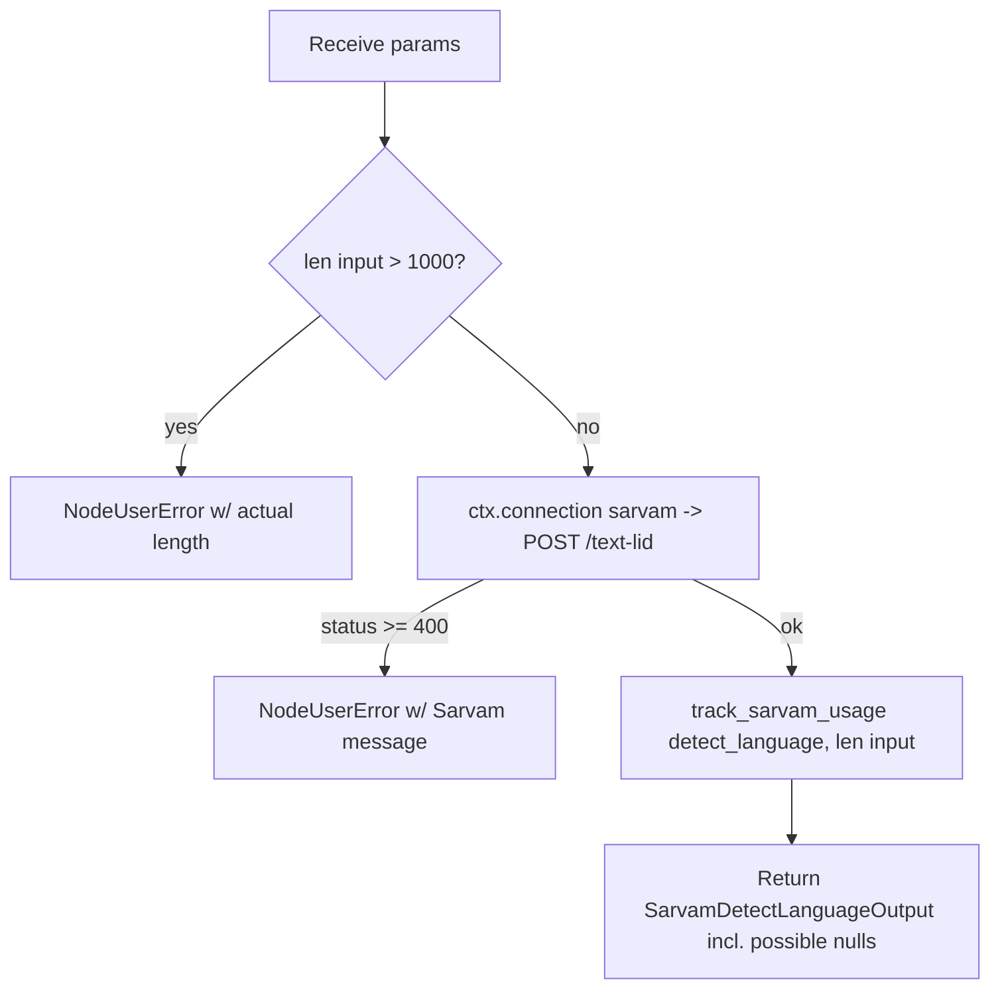

# Sarvam Detect Language (`sarvamDetectLanguage`)

| Field | Value |
|------|-------|
| **Category** | language |
| **Backend handler** | [`server/nodes/sarvam/sarvam_detect_language.py`](../../../server/nodes/sarvam/sarvam_detect_language.py) |
| **Shared helpers** | [`server/nodes/sarvam/_base.py`](../../../server/nodes/sarvam/_base.py) (`post_json`, `track_sarvam_usage`) |
| **Tests** | [`server/tests/nodes/test_sarvam.py`](../../../server/tests/nodes/test_sarvam.py) |
| **Skill (if any)** | [`server/skills/language_agent/sarvam-translate-skill/SKILL.md`](../../../server/skills/language_agent/sarvam-translate-skill/SKILL.md) |
| **Dual-purpose tool** | yes — tool name `sarvam_detect_language` |

## Purpose

Identify which Indian language a piece of text is written in and in which
script, via Sarvam's `/text-lid` endpoint. Typically used to route a message
to the right handler, or to supply an explicit `source_language_code` to a
downstream translate call.

## Inputs (handles)

| Handle | Connection type | Required | Purpose |
|--------|-----------------|----------|---------|
| `input-main` | main | no | Upstream data injected into params |

## Parameters

| Name | Type | Default | Required | displayOptions.show | Description |
|------|------|---------|----------|---------------------|-------------|
| `input` | string | - | yes | - | Text to classify (max 1000 characters) |

## Outputs (handles)

| Handle | Shape | Description |
|--------|-------|-------------|
| `output-main` | object | Standard envelope payload |

### Output payload

```ts
{
  language_code: string | null;  // en-IN hi-IN bn-IN gu-IN kn-IN ml-IN mr-IN od-IN pa-IN ta-IN te-IN
  script_code: string | null;    // Latn Deva Beng Gujr Knda Mlym Orya Guru Taml Telu
  request_id: string | null;
}
```

Both classification fields are `Optional` on the output model **by design** —
Sarvam returns nulls for text it cannot classify, and coercing those to `""`
would hide the failure from downstream nodes.

## Logic Flow



## Decision Logic

- **Validation**: input over 1000 characters short-circuits before the HTTP
  call with the actual length in the message.
- **Null passthrough**: an unclassifiable result is a *successful* envelope
  with null fields, not an error. Callers must check before chaining.
- **Error paths**: non-2xx becomes `NodeUserError` with Sarvam's own message.

## Side Effects

- **Database writes**: one `api_usage_metrics` row per call (characters).
- **Broadcasts**: standard node status only.
- **External API calls**: `POST https://api.sarvam.ai/text-lid`, `api-subscription-key` header.
- **File I/O**: none.
- **Subprocess**: none.

## External Dependencies

- **Credentials**: `SarvamCredential` via `ctx.connection("sarvam")`.
- **Python packages**: `httpx` (through `Connection`).

## Edge cases & known limits

- **Nulls are normal.** Short or ambiguous input returns `language_code: null`
  and `script_code: null`. Feeding that straight into `sarvamTranslate` as a
  source language will fail — check first, or pass `auto`.
- 1000-character hard cap; sample or truncate longer text rather than looping.
- Covers 11 languages, fewer than translate's 22.
- Cheapest of the Sarvam text APIs (3.5 INR / 10K characters).

## Related

- **Skills using this as a tool**: `sarvam-translate-skill`.
- **Downstream nodes**: [`sarvamTranslate`](./sarvamTranslate.md) (pass the detected code as `source_language_code`).
- **Architecture docs**: [Sarvam AI Service](../../sarvam_service.md).
