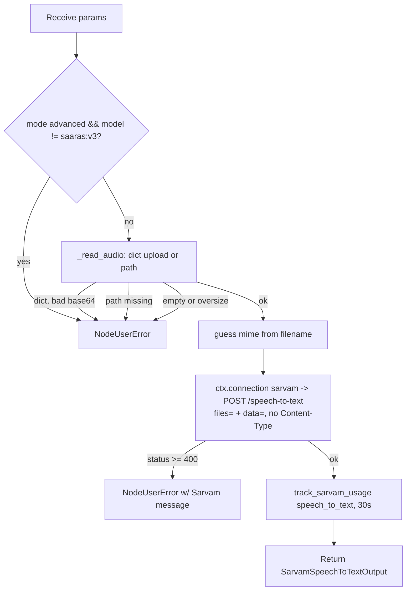

# Sarvam Speech to Text (`sarvamSpeechToText`)

| Field | Value |
|------|-------|
| **Category** | language |
| **Backend handler** | [`server/nodes/sarvam/sarvam_speech_to_text.py`](../../../server/nodes/sarvam/sarvam_speech_to_text.py) |
| **Shared helpers** | [`server/nodes/sarvam/_base.py`](../../../server/nodes/sarvam/_base.py) (`post_multipart`, `track_sarvam_usage`) |
| **Tests** | [`server/tests/nodes/test_sarvam.py`](../../../server/tests/nodes/test_sarvam.py), [`server/tests/services/test_connection_multipart.py`](../../../server/tests/services/test_connection_multipart.py) |
| **Skill (if any)** | [`server/skills/language_agent/sarvam-speech-skill/SKILL.md`](../../../server/skills/language_agent/sarvam-speech-skill/SKILL.md) |
| **Dual-purpose tool** | yes — tool name `sarvam_speech_to_text` |

## Purpose

Transcribe short audio clips across 23 Indian languages using Sarvam's Saaras
models, with optional direct translation to English. This is the repo's first
`multipart/form-data` node.

## Inputs (handles)

| Handle | Connection type | Required | Purpose |
|--------|-----------------|----------|---------|
| `input-main` | main | no | Upstream data injected into params (commonly a file path) |

## Parameters

| Name | Type | Default | Required | displayOptions.show | Description |
|------|------|---------|----------|---------------------|-------------|
| `audio_file` | string \| object | `""` | yes | - | Path, **or** the file-widget upload envelope. `widget: file`, `accept: audio/*` |
| `model` | enum | `saaras:v3` | no | - | `saaras:v3` (23 langs) / `saarika:v2.5` (legacy) |
| `language_code` | string | `unknown` | no | - | BCP-47, or `unknown` to auto-detect |
| `mode` | enum | `transcribe` | no | - | `transcribe` / `translate` / `verbatim` / `translit` / `codemix` |
| `input_audio_codec` | enum\|null | `null` | no | - | `pcm_s16le` / `pcm_l16` / `pcm_raw` — headerless PCM only |

## Outputs (handles)

| Handle | Shape | Description |
|--------|-------|-------------|
| `output-main` | object | Standard envelope payload |

### Output payload

```ts
{
  transcript: string;
  language_code: string | null;
  language_probability: number | null;   // null when language_code was supplied
  timestamps: object | null;             // conditional
  diarized_transcript: object | null;    // Batch API only — always null here
  request_id: string | null;
}
```

## Logic Flow



## Decision Logic

- **Mode/model compatibility**: `verbatim` / `translit` / `codemix` require
  `saaras:v3`; asking for them on `saarika:v2.5` fails before the call.
- **Dual-shaped `audio_file`** (`_read_audio`): the frontend file widget sends
  `{"type": "upload", "data": "<base64>", "filename", "mimeType"}` when the
  user picks a file, and a bare string when they type a path or drag an
  upstream value in. The param is typed `Union[str, Dict]` for exactly this
  reason — `whatsapp_send` declares the same field as `str` and only survives
  because its handler reads the raw dict.
- **Path resolution**: relative paths resolve against `ctx.workspace_dir`, so
  they line up with `fileDownloader` and `sarvamTextToSpeech` output.
- **Size guard**: empty files and payloads over 24 MB fail with a message that
  names the 30-second limit and points at the Batch API.
- **Billing**: `resource_count` is the documented 30-second ceiling; the node
  does not decode the clip to measure real duration.

## Side Effects

- **Database writes**: one `api_usage_metrics` row per call (seconds).
- **Broadcasts**: standard node status only.
- **External API calls**: `POST https://api.sarvam.ai/speech-to-text` as `multipart/form-data`, `api-subscription-key` header.
- **File I/O**: reads the audio file when given a path. Writes nothing.
- **Subprocess**: none.

## External Dependencies

- **Credentials**: `SarvamCredential` via `ctx.connection("sarvam")`.
- **Framework**: `Connection.request(files=)` — added generically for this
  node and threaded through the auth-retry rebuild, so a 401 replays the file
  parts rather than an empty body. Pass **bytes**, never an open handle.
- **Python packages**: `httpx` (through `Connection`), stdlib `base64` / `mimetypes`.

## Edge cases & known limits

- **30-second hard limit.** This is the synchronous endpoint; longer audio
  needs Sarvam's Batch API, which is a separate job-based surface and is not
  wired. Tell the user rather than retrying.
- **Diarization is Batch-only.** `diarized_transcript` is declared on the
  output model for shape stability but will always be `null` here.
- Accuracy is best at 16 kHz; PCM inputs are limited to 16 kHz.
- `language_probability` is `null` whenever `language_code` was supplied
  explicitly (nothing was inferred).
- No streaming — the WebSocket transcription surface is not wired.

## Related

- **Skills using this as a tool**: `sarvam-speech-skill`.
- **Peer nodes**: [`sarvamTextToSpeech`](./sarvamTextToSpeech.md) (the other half of a voice loop).
- **Architecture docs**: [Sarvam AI Service](../../sarvam_service.md).
