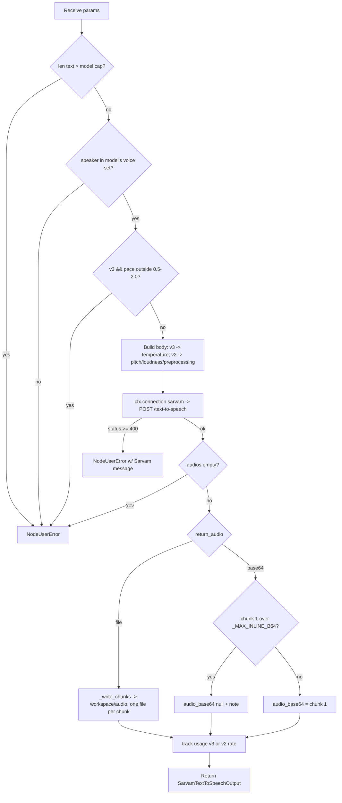

# Sarvam Text to Speech (`sarvamTextToSpeech`)

| Field | Value |
|------|-------|
| **Category** | language |
| **Backend handler** | [`server/nodes/sarvam/sarvam_text_to_speech.py`](../../../server/nodes/sarvam/sarvam_text_to_speech.py) |
| **Shared helpers** | [`server/nodes/sarvam/_base.py`](../../../server/nodes/sarvam/_base.py) (`post_json`, `track_sarvam_usage`) |
| **Tests** | [`server/tests/nodes/test_sarvam.py`](../../../server/tests/nodes/test_sarvam.py) |
| **Skill (if any)** | [`server/skills/language_agent/sarvam-speech-skill/SKILL.md`](../../../server/skills/language_agent/sarvam-speech-skill/SKILL.md) |
| **Dual-purpose tool** | yes — tool name `sarvam_text_to_speech` |

## Purpose

Synthesize natural speech in 11 Indian languages using Sarvam's Bulbul voices
(37 on v3, 7 on v2). Writes audio into the workflow workspace and returns a
path; inline base64 is opt-in and size-capped.

## Inputs (handles)

| Handle | Connection type | Required | Purpose |
|--------|-----------------|----------|---------|
| `input-main` | main | no | Upstream data injected into params |

## Parameters

| Name | Type | Default | Required | displayOptions.show | Description |
|------|------|---------|----------|---------------------|-------------|
| `text` | string | - | yes | - | Text to speak (2500 chars v3, 1500 v2) |
| `target_language_code` | enum | `hi-IN` | no | - | 11 core codes |
| `model` | enum | `bulbul:v3` | no | - | `bulbul:v3` / `bulbul:v2` |
| `speaker` | string | `shubh` | no | - | Voice name, lowercase. Per-model sets |
| `pace` | number | `1.0` | no | - | v3 0.5-2.0, v2 0.3-3.0 |
| `speech_sample_rate` | enum | `24000` | no | - | 8000 / 16000 / 22050 / 24000 / 32000 / 44100 / 48000 |
| `output_audio_codec` | enum | `wav` | no | - | wav / mp3 / linear16 / mulaw / alaw / opus / flac / aac |
| `temperature` | number\|null | `null` | no | `model: [bulbul:v3]` | 0.01-2.0, v3 only |
| `pitch` | number\|null | `null` | no | `model: [bulbul:v2]` | -0.75 to 0.75, v2 only |
| `loudness` | number\|null | `null` | no | `model: [bulbul:v2]` | 0.3-3.0, v2 only |
| `enable_preprocessing` | boolean\|null | `null` | no | `model: [bulbul:v2]` | v2 only (v3 always preprocesses) |
| `return_audio` | enum | `file` | no | - | `file` / `base64` |

## Outputs (handles)

| Handle | Shape | Description |
|--------|-------|-------------|
| `output-main` | object | Standard envelope payload |

### Output payload

```ts
{
  file_path: string | null;      // chunk 1; null in base64 mode
  files: string[];               // one entry per chunk
  chunk_count: number;
  audio_format: string;          // echoes output_audio_codec
  audio_base64: string | null;   // opt-in, size-capped
  note: string | null;           // multi-chunk or suppression explanation
  request_id: string | null;
}
```

## Logic Flow



## Decision Logic

- **Per-model validation**: character cap, voice-set membership and (for v3)
  pace range all fail before the HTTP call. A v2 voice on v3 is an error, not
  a silent fallback.
- **Version-gated body**: v3 sends `temperature`; v2 sends `pitch` /
  `loudness` / `enable_preprocessing`. They are mutually exclusive because v3
  rejects the v2 fields outright — `displayOptions` hides them in the UI and
  the body builder filters them regardless of what the caller sent.
- **Default is file, not base64.** A 2500-character v3 request is roughly
  12 MB of base64, which would land in the `node_outputs` JSON column, ride a
  status-WebSocket broadcast, and — because this node is tool-exposed — be
  serialized into an LLM message.
- **Inline cap**: `_MAX_INLINE_B64 = 1_000_000`. Over it, `audio_base64` stays
  `None` and `note` says why and names `return_audio='file'`. Never a silent
  truncation.
- **Multi-chunk**: Sarvam may split long text across `audios[]`. Each chunk is
  a standalone container with its own header, so byte-wise concatenation
  produces an unplayable file. One file per chunk; `file_path` is chunk 1;
  `note` explains.
- **Billing**: `bulbul:v2` is half the v3 character rate, so the tracked
  action differs (`text_to_speech` vs `text_to_speech_v2`).

## Side Effects

- **Database writes**: one `api_usage_metrics` row per call (characters).
- **Broadcasts**: standard node status only.
- **External API calls**: `POST https://api.sarvam.ai/text-to-speech`, `api-subscription-key` header.
- **File I/O**: writes `<workspace_dir>/audio/<slug>-<node8>-<rand6>[-N].<ext>` in `file` mode; creates the directory if absent. Falls back to a relative `audio/` dir when no workspace is set.
- **Subprocess**: none.

## External Dependencies

- **Credentials**: `SarvamCredential` via `ctx.connection("sarvam")`.
- **Python packages**: `httpx` (through `Connection`), stdlib `base64` / `uuid` / `re`.

## Edge cases & known limits

- **Audio is a file, not bytes.** Downstream nodes should consume `file_path`.
  Only reach for `return_audio: "base64"` for very short clips that must be
  inlined (e.g. chaining into `whatsappSend` with `media_source: "base64"`).
- Voice sets do not overlap between v2 and v3.
- `pitch` / `loudness` are silently unavailable on v3 — that is Sarvam's
  limitation, surfaced through `displayOptions` rather than an error.
- Sample rates above 24000 are v3-REST-only.
- No streaming — the HTTP-stream and WebSocket TTS surfaces are not wired.
- Filenames embed a random suffix, so repeated runs never collide or
  silently overwrite prior audio.

## Related

- **Skills using this as a tool**: `sarvam-speech-skill`.
- **Upstream nodes**: [`sarvamTransliterate`](./sarvamTransliterate.md) with `spoken_form: true` produces speech-ready text.
- **Peer nodes**: [`sarvamSpeechToText`](./sarvamSpeechToText.md).
- **Architecture docs**: [Sarvam AI Service](../../sarvam_service.md).
