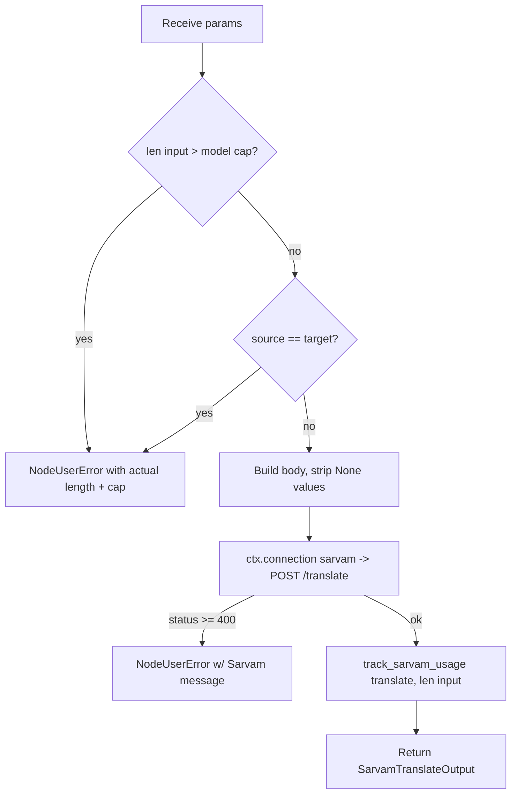

# Sarvam Translate (`sarvamTranslate`)

| Field | Value |
|------|-------|
| **Category** | language |
| **Backend handler** | [`server/nodes/sarvam/sarvam_translate.py`](../../../server/nodes/sarvam/sarvam_translate.py) |
| **Shared helpers** | [`server/nodes/sarvam/_base.py`](../../../server/nodes/sarvam/_base.py) (`post_json`, `track_sarvam_usage`) |
| **Tests** | [`server/tests/nodes/test_sarvam.py`](../../../server/tests/nodes/test_sarvam.py) |
| **Skill (if any)** | [`server/skills/language_agent/sarvam-translate-skill/SKILL.md`](../../../server/skills/language_agent/sarvam-translate-skill/SKILL.md) |
| **Dual-purpose tool** | yes — tool name `sarvam_translate` |

## Purpose

Translate text between English and 22 Indian languages via Sarvam's
`/translate` endpoint. Supports formal, colloquial and code-mixed registers,
optional gendered inflection, and output-script control (native, Roman, or
spoken form). Distinct from `sarvamTransliterate`, which changes script
without changing language.

## Inputs (handles)

| Handle | Connection type | Required | Purpose |
|--------|-----------------|----------|---------|
| `input-main` | main | no | Upstream data injected into params |

## Parameters

| Name | Type | Default | Required | displayOptions.show | Description |
|------|------|---------|----------|---------------------|-------------|
| `input` | string | - | yes | - | Text to translate |
| `source_language_code` | enum | `auto` | no | - | `auto` + the 22 language codes |
| `target_language_code` | enum | `hi-IN` | no | - | The 22 language codes (no `auto`) |
| `model` | enum | `sarvam-translate:v1` | no | - | `sarvam-translate:v1` (22 langs, 2000 chars) / `mayura:v1` (1000 chars) |
| `mode` | enum | `formal` | no | - | `formal` / `modern-colloquial` / `classic-colloquial` / `code-mixed` |
| `speaker_gender` | enum\|null | `null` | no | - | `Male` / `Female` |
| `output_script` | enum\|null | `null` | no | - | `roman` / `fully-native` / `spoken-form-in-native` |
| `numerals_format` | enum | `international` | no | - | `international` / `native` |

Language codes: `as-IN bn-IN brx-IN doi-IN en-IN gu-IN hi-IN kn-IN kok-IN
ks-IN mai-IN ml-IN mni-IN mr-IN ne-IN od-IN pa-IN sa-IN sat-IN sd-IN ta-IN
te-IN ur-IN`.

## Outputs (handles)

| Handle | Shape | Description |
|--------|-------|-------------|
| `output-main` | object | Standard envelope payload |

### Output payload

```ts
{
  translated_text: string;
  source_language_code: string;  // detected when input was 'auto'
  request_id: string | null;
}
```

## Logic Flow



## Decision Logic

- **Validation**: input over the per-model character cap, and an identical
  source/target pair, both short-circuit before the HTTP call — no paid call
  is burned on a guaranteed no-op.
- **`None` stripping**: `post_json` drops unset optionals rather than sending
  explicit nulls; Sarvam 422s on several of those.
- **Error paths**: non-2xx becomes `NodeUserError` carrying Sarvam's own
  `error.message` (or `message` / `detail`), prefixed with the status code.

## Side Effects

- **Database writes**: one `api_usage_metrics` row per call (characters as `resource_count`).
- **Broadcasts**: standard node status only.
- **External API calls**: `POST https://api.sarvam.ai/translate`, `api-subscription-key` header.
- **File I/O**: none.
- **Subprocess**: none.

## External Dependencies

- **Credentials**: `SarvamCredential` (`nodes/model/_credentials.py`) via `ctx.connection("sarvam")`.
- **Python packages**: `httpx` (through `Connection`).

## Edge cases & known limits

- Caps are per model: 1000 chars for `mayura:v1`, 2000 for `sarvam-translate:v1`. Split on sentence boundaries for longer text — splitting mid-sentence degrades quality.
- `mayura:v1` covers only 10 languages despite the shared enum; an unsupported pair returns a Sarvam 422 surfaced verbatim.
- Usage is billed per character; transliteration has no separately published rate and is priced identically in `pricing.json`.

## Related

- **Skills using this as a tool**: `sarvam-translate-skill`.
- **Peer nodes**: [`sarvamTransliterate`](./sarvamTransliterate.md), [`sarvamDetectLanguage`](./sarvamDetectLanguage.md).
- **Architecture docs**: [Sarvam AI Service](../../sarvam_service.md).
