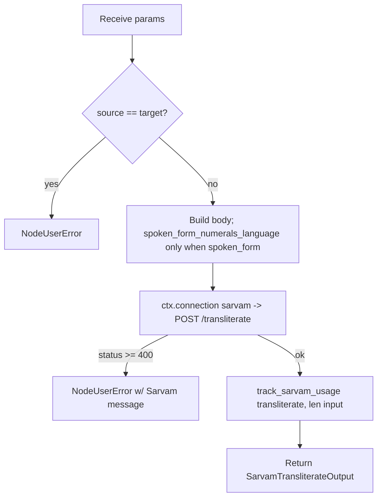

# Sarvam Transliterate (`sarvamTransliterate`)

| Field | Value |
|------|-------|
| **Category** | language |
| **Backend handler** | [`server/nodes/sarvam/sarvam_transliterate.py`](../../../server/nodes/sarvam/sarvam_transliterate.py) |
| **Shared helpers** | [`server/nodes/sarvam/_base.py`](../../../server/nodes/sarvam/_base.py) (`post_json`, `track_sarvam_usage`) |
| **Tests** | [`server/tests/nodes/test_sarvam.py`](../../../server/tests/nodes/test_sarvam.py) |
| **Skill (if any)** | [`server/skills/language_agent/sarvam-translate-skill/SKILL.md`](../../../server/skills/language_agent/sarvam-translate-skill/SKILL.md) |
| **Dual-purpose tool** | yes — tool name `sarvam_transliterate` |

## Purpose

Convert text between scripts while preserving pronunciation — romanised Hindi
("namaste") to Devanagari ("नमस्ते") and back. **This is not translation**:
the words and meaning are unchanged, only the writing system. Optionally
expands numerals and abbreviations into spoken form, which is useful when the
output feeds `textToSpeech`.

## Inputs (handles)

| Handle | Connection type | Required | Purpose |
|--------|-----------------|----------|---------|
| `input-main` | main | no | Upstream data injected into params |

## Parameters

| Name | Type | Default | Required | displayOptions.show | Description |
|------|------|---------|----------|---------------------|-------------|
| `input` | string | - | yes | - | Text to transliterate |
| `source_language_code` | enum | `auto` | no | - | `auto` + the 11 core codes |
| `target_language_code` | enum | `hi-IN` | no | - | The 11 core codes |
| `numerals_format` | enum | `international` | no | - | `international` / `native` |
| `spoken_form` | boolean | `false` | no | - | Expand numbers / dates / abbreviations as spoken |
| `spoken_form_numerals_language` | enum | `native` | no | `spoken_form: [true]` | `english` / `native` |

Language codes: `bn-IN en-IN gu-IN hi-IN kn-IN ml-IN mr-IN od-IN pa-IN ta-IN
te-IN` (a narrower set than `sarvamTranslate`).

## Outputs (handles)

| Handle | Shape | Description |
|--------|-------|-------------|
| `output-main` | object | Standard envelope payload |

### Output payload

```ts
{
  transliterated_text: string;
  source_language_code: string;
  request_id: string | null;
}
```

## Logic Flow



## Decision Logic

- **Validation**: identical source/target short-circuits before the HTTP call.
- **Conditional field**: `spoken_form_numerals_language` is set to `None` (and
  therefore stripped by `post_json`) unless `spoken_form` is true, so the API
  never receives a meaningless pairing.
- **Error paths**: non-2xx becomes `NodeUserError` with Sarvam's own message.

## Side Effects

- **Database writes**: one `api_usage_metrics` row per call (characters).
- **Broadcasts**: standard node status only.
- **External API calls**: `POST https://api.sarvam.ai/transliterate`, `api-subscription-key` header.
- **File I/O**: none.
- **Subprocess**: none.

## External Dependencies

- **Credentials**: `SarvamCredential` via `ctx.connection("sarvam")`.
- **Python packages**: `httpx` (through `Connection`).

## Edge cases & known limits

- Narrower language set than translate — 11 codes, not 22.
- No published per-character rate; `pricing.json` prices it as translation.
- Easy to reach for by mistake: if the goal is changing *language*, use
  [`sarvamTranslate`](./sarvamTranslate.md). The skill spells out the
  distinction for the LLM.

## Related

- **Skills using this as a tool**: `sarvam-translate-skill`.
- **Peer nodes**: [`sarvamTranslate`](./sarvamTranslate.md), [`textToSpeech`](./textToSpeech.md) (a common downstream consumer of spoken-form output).
- **Architecture docs**: [Sarvam AI Service](../../sarvam_service.md).
